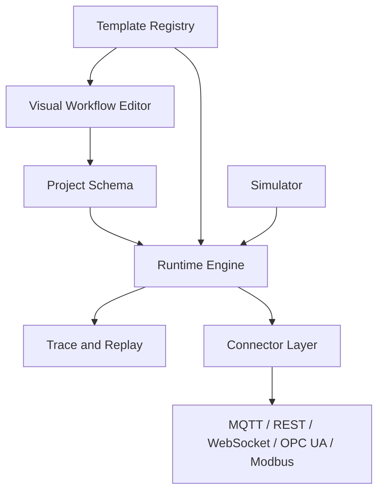

# Architecture Overview

OpenForge Core is organized around stable project schemas, a deterministic runtime, reusable industrial templates, simulation tools, connector adapters, and debugging traces.

## Principles

- Keep workflow definitions JSON/YAML friendly.
- Keep protocols behind connector interfaces.
- Keep runtime behavior transparent and replayable.
- Treat simulation as the default local development path.
- Keep AI-readiness in the data model, not as an MVP feature dependency.
