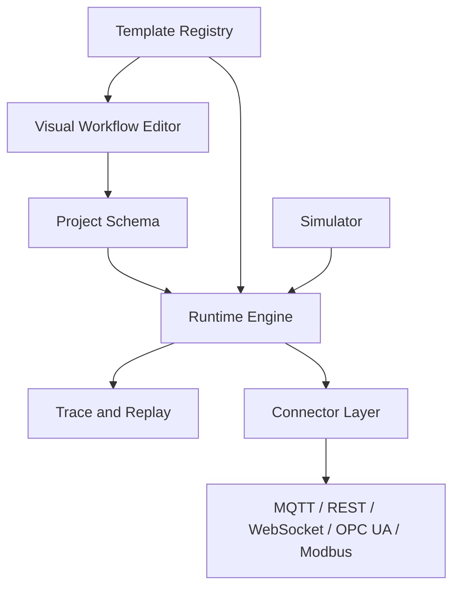

# Architecture Overview

OpenForge Core is organized around stable project schemas, a deterministic runtime, reusable industrial templates, simulation tools, connector adapters, and debugging traces. The product direction is a simulation-first industrial workflow platform with a visual designer on top, not a JSON editor with a canvas attached.

## Domain Boundaries

- Connection profiles describe reusable external systems such as MQTT brokers, OPC UA servers, Modbus devices, REST endpoints, or simulation sources.
- Nodes describe actions or logic such as read, write, transform, condition, timer, alarm, publish, or log marker.
- Edges describe workflow relationships between nodes. They are typed as data, control, event, or error flow and do not represent protocol connections.
- Node definitions live in the template registry and provide palette metadata, ports, property schemas, validation rules, and runtime handler IDs.

## Principles

- Keep workflow definitions JSON/YAML friendly.
- Keep protocols behind connector interfaces.
- Keep runtime behavior transparent and replayable.
- Treat simulation as the default local development path.
- Keep AI-readiness in the data model, not as an MVP feature dependency.
- Keep the open-source core extensible without adding licensing gates to the base runtime or designer.
