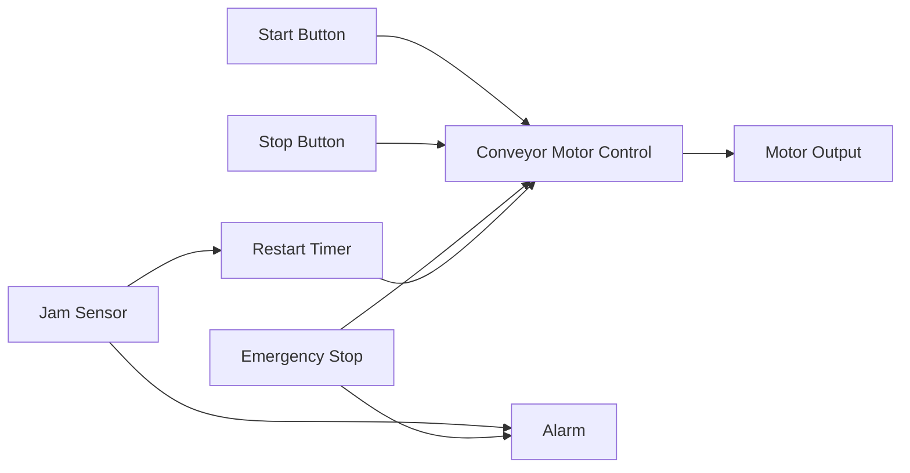

# Conveyor Automation Demo

This demo models a small conveyor automation workflow with operator start/stop inputs, emergency stop, jam sensor, conveyor motor output, alarm handling, and timer-based restart logic.

## Architecture



## Inputs and Outputs

- Start button emits a digital signal to the conveyor start input.
- Stop button emits a digital signal to the conveyor stop input.
- Emergency stop emits a digital signal to stop the conveyor and trigger the alarm.
- Jam sensor emits a digital signal to trigger the alarm and restart timer.
- Conveyor running output drives the motor output.

## Runtime Behavior

The nominal scenario schedules a start signal at tick 1 and a stop signal at tick 6. Future scenarios will add jam recovery and emergency-stop reset behavior once the runtime contains stateful template execution.

## Setup

```powershell
pnpm install
pnpm validate:examples
pnpm build
pnpm demo:conveyor
```

## Expected Execution Behavior

The workflow should load as a valid OpenForge project. The visual editor should place operator inputs on the left, control logic in the middle, and motor output on the right. Runtime traces should show signal propagation across each connected edge.

## Troubleshooting

- If validation fails, confirm `workflow.json` is valid JSON.
- If a node is missing in the editor, check that its `templateId` exists in `@openforge/templates`.
- If a signal does not propagate, confirm the edge source and target port IDs match the node port IDs.
